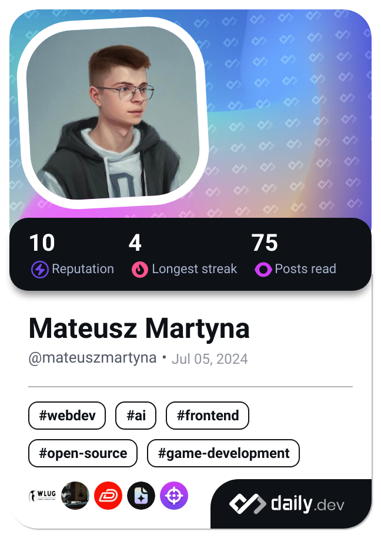

<h1 align="center">
    
</h1>

<h3 align="center">I'm a software developer from Poland 🇵🇱</h3>

 

    
    
    

<h2 align="center">🧰 Languages - Frameworks - Tools 🧰</h2>
 

    <a href="https://skillicons.dev">
         
        
    </a>

 

    <h2>🌿 My Contributions</h2>
     
    
     
     
     

    
